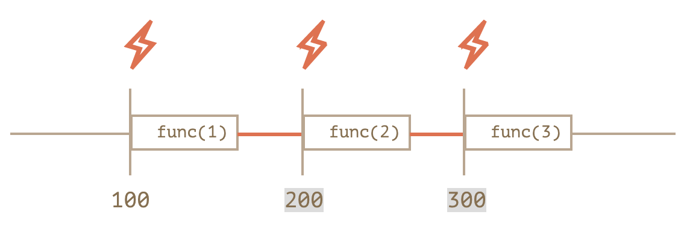
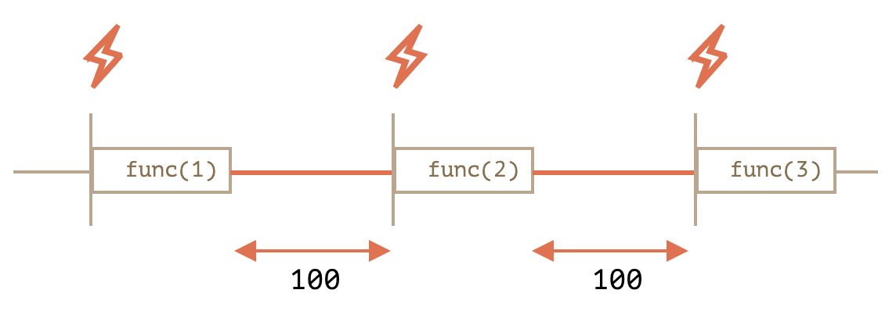

# setTimeout과 setInerval을 이용한 호출 스케줄링

호출스케줄링 : 일정 시간이 지난 후에 원하는 함수를 예약 실행(호출)할 수 있게 하는 것.

호출 스케줄링을 구현하는 방법에는 `setTimeout`과 `setInterval`을 이용하는 방법이 있다. 

## setTimeout()
```javascript
let timerId = setTimeout(func|code, [delay], [arg1], [arg2], ...)
```

### `func|code`
실행하고자 하는 코드로 **함수** 또는 **문자열** 형태로 넣어야 한다.

### `delay`
실행 전 대기시간으로, 단위는 millisecond(100밀리초 = 1초)이며 기본값은 0이다.

### `arg1`, `arg2` ....
함수에 전달할 인수들로, IE9 이하에서는 지원하지 않는다.

<br/>


```javascript
function sayHi() {
  alert('안녕하세요');
}

setTimout(sayHi, 1000);
```

```javascript
function sayHi(who, phrase) {
  alert( who + '님, ' + phrase );
}

setTimeout(sayHi, 1000, "홍길동", "안녕하세요."); // 홍길동 님, 안녕하세요.
```
<br/>

`setTimeout`의 첫 번째 인수가 문자열이면 자바스크립트는 이 문자열을 이용해 함수를 만든다.    
하지만 문자열을 직접 사용하기보다, 익명 화살표 함수를 사용하는 것이 좋다.

<br/>

```javascript
// bad
setTimeout("alert('hello~~!')", 1000);

// good
setTimeout(() => alert('hello~~~!'), 1000);
```

<br/>

### 함수를 실행하지 말자.
```javascript
// bad
setTimeout(sayHi(), 1000);
```
`setTimeout`은 함수의 참조 값을 받도록 정의되어 있다. 따라서, `sayHi()`를 인수로 전달하면 함수의 실행 결과가 전될되게 된다. 그런데 `sayHi()`에는 반환문이 없다. 그렇기 때문에 호출 결과는 `undefined`가 나올 것이다. 따라서 `setTimeout`은 스케줄링 할 대상을 찾지 못해 원하는대로 코드가 동작하지 않게 된다.

<br/>


## clearTimeout()
`setTimeout`을 호출하면 **타이머 식별자(timer identifier)**가 반환된다. 스케줄링을 취소하고 싶다면 이 식별자를 사용하면 된다.

```javascript
let timerId = setTimeout(...);
clearTimeout(timerId);

// 위 코드에서는 timerId가 타이머 식별자.
```

<br/><br/>

## setInterval()
```javascript
let timerId = setInterval(func|code, [delay], [arg1], [arg2], ...)
```
<br/>

`setInerval`은 함수를 주기적으로 실행하게 만든다.     
함수 호출을 중단하려면 `clearInterval(timerId)`를 사용하면 된다.

<br/>

```javascript
let timerId = setInerval(() => alert('hello'), 2000);

setTimeout(() => {
  clearInterval(timerId);
  alert('stop');
}, 5000);

// 2초 간격으로 메시지를 보여주다, 5초 후에 정지.
```

### `alert` 창이 떠 있더라도 타이머는 멈추지 않는다.
Chrome, Firefox 등 대부분의 브라우저는 `alert`,  `confirm`, `prompt` 창이 떠 있는 동안에도 내부 타이머를 멈추지 않는다. 

위 예시 코드를 실행하고 첫 번째 `alert` 창이 떴을 때 몇 초간 기다렸다 창을 닫으면, 두 번째 `alert` 창이 바로 나타나는 것을 보고 이를 확인할 수 있다. 

이런 이유로 명시한 지연 시간인 2초보다 더 짧은 간격으로 alert이 뜨게 된다.

<br/><br/>

## 중첩 setTimeout()
일정 간격을 두고 실행하는 방법에는 `setInterval` 뿐만 아니라, 중첩 `setTimeout`을 이용해서도 가능하다.

<br/>

```javascript
let timerId = setTimeout(function tick() {
  alert('ticktok');
  timerId = setTimeout(tick, 2000);
}, 2000);


// 위 코드를 setInterval()로 작성하면 아래와 같다.
let timerId = setInterval(() => alert('ticktok'), 2000);
```

<br/>

중첩 `setTimeout`은 `setInterval`보다 유연하게 사용 가능하다.   
호출 결과에 따라 다음 호출을 원하는 방식으로 조정해 스케줄링 할 수 있다.

만약 5초 간격으로 서버에 요청을 보내 데이터를 얻을 경우, 서버가 과부하 상태라면 요청 간격을 10초, 20초, 40초 등으로 증가시켜 주는 것이 좋을 것이다.    
이를 코드로 구현해보자.
```javascript
let delay = 5000;

let timerId = setTimeout(function request() {
  ...요청 보내기...
  
  if (서버 과부하로 인한 요청 실패) {
    // 요청 간격 늘리기.
    delay += 2;
  }
  
  timerId = setTimeout(request, delay);
  
}, delay);
```

<br/>

CPU 소모가 많은 작업을 주기적으로 실행하는 경우에도 `setTimeout`을 재귀 실행하는 방법이 유용하다. 작업에 걸리는 시간에 따라 다음 작업을 유동적으로 계획할 수 있기 떄문이다.

<br/>

*** 중첨 `setTimeout`을 이용하는 방법은 지연 간격을 보장하지만, `setInterval`은 이를 보장하지 않는다.

`setInterval`을 이용한 예시.
```javascript
let i = 1;

setInterval(function() {
  func(i++);
}, 100);
```

<br/>

`setTimeout`을 이용한 예시.
```javascript
let i = 1;

setTimeout(function run() {
  func(i++);
  setTimeout(run, 100);
}, 100);
```

<br/>

첫 번째 `setInterval`을 이용한 예시에서는 내부 스케줄러가 `func(i++)`를 100밀리초마다 실행한다.



**`setInterval`을 사용**하면 `func` 호출 사이의 **지연 간격이 실제 명시한 간격(100ms)보다 짧아진다.**     
`func`를 실행하는데 **소모되는** 시간도 지연 간격에 포함시키기 때문이다.    

만약 `func`를 실행하는데 걸리는 시간이 명시간 지연 간격보다 길다면 어떻게 될까?   
이 경우에는 엔진이 `func`의 실행이 종료될 때까지 기다려준다. `func`의 실행이 종료되면 엔진은 스케줄러를 확인하고, 지연 시간이 지났으면 다음 호출을 **바로** 시작한다.

따라서 함수 호출에 걸리는 시간이 매번 `delay` 밀리초보다 길면, 모든 함수가 쉼 없이 계속 연속 호출된다.

<br/>

두 번째 `setTimeout`을 이용한 예시에서는 명시한 지연(위 예시에서는 100ms)이 보장된다.  
지연 간격이 보장되는 이유는 이전 함수의 실행이 종료된 이후에 다음 함수 호출에 대한 계획이 세워지기 때문이다.



<br/>

### 가비지 컬렉션과 `setInterval` & `setTimeout`
`setInterval`이나 `setTimeout`에 함수를 넘기면, 함수에 대한 내부 참조가 새롭게 만들어지고, 이 참조 정보는 스케줄러에 저장된다. 따라서 해당 함수를 참조하는 것이 없어도 `setInterval`과 `setTimeout`에 넘긴 함수는 가비지 컬렉션의 대상이 되지 않는다.

<br/>

```javascript
// 스케줄러가 함수를 호출할 때까지 함수는 메모리에 유지된다.
setTimeout(function() {...}, 100);
```

<br/>

`setInterval`의 경우 `clearInterval`이 호출되기 전까지 함수에 대한 참조가 메모리에 유지된다.   

그러나 이 동작 방식에는 부작용이 하나 있다. 외부 렉시컴 환경을 참조하는 함수가 있다고 가정할 경우, 이 함수가 메모리에 남아있는 동안엔 외부 변수 역시 메모리에 남아있게 된다. 

이렇게 되면 실제 함수가 차지했어야 하는 공간보다 더 많은 메모리 공간이 사용된다. 이런 부작용을 방지하고 싶다면 스케줄링할 필요가 없어진 함수는 아무리 작더라도 취소하도록 하자.

<br/><br/>


## 대기 시간이 0인 `setTimeout`

`setTimeout(func, 0)`이나 `setTimeout(func)`을 `setTimeout`의 대기 시간을 0으로 설정할 수 있다.

이렇게 대기 시간을 0으로 설정하면 `func`을 가능한 빨리 실행할 수 있다. 다만, 이때 스케줄러는 현재 실행 중인 스크립트의 처리가 종료된 이후에 스케줄링한 함수를 실행한다. 

이런 특징을 이용해 현재 스크립트의 실행이 종료된 **직후**에 원하는 함수가 실행될 수 있게 할 수 있다.

```javascript
setTimeout(() => alert("world"));

alert("hello");

// hello
// world
```


<br/><br/>

***

<br/>

[해당 글](https://ko.javascript.info/settimeout-setinterval)을 참고 함.


